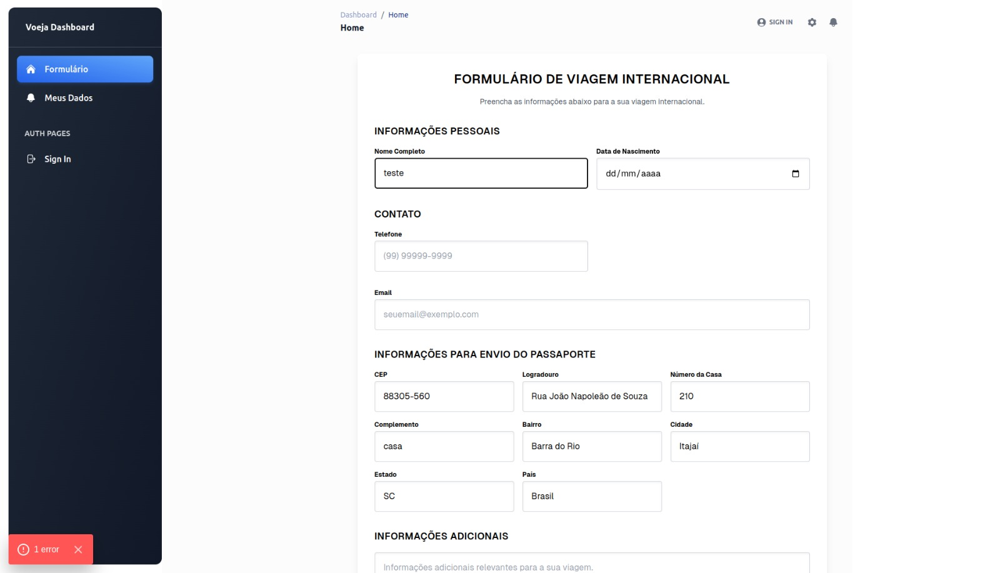
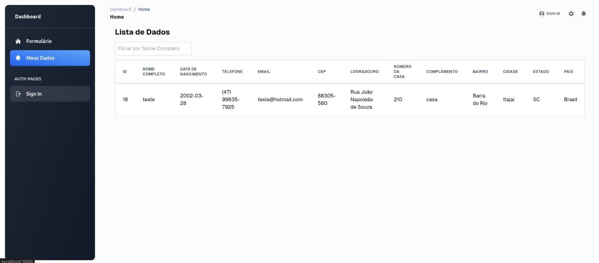

# Formulario de viagem  

## Executando o Projeto Localmente

Para executar este projeto localmente, siga estas etapas:

1. **Clone o repositório:**

2. **Instale as dependências:**

Primeiramente execute `npm install` para instalar todas as dependências do seu projeto localmente.

3. **Rodando seu projeto localmente:**
Execute `npm run dev` para rodar seu projeto localmente na porta `http://localhost:3000`. 
Não foi adicionado login com authenticated, então basta clicar em entrar que ele vai direto.

## Funcionalidade do formulario de viagem internacional

O formulario de viagem permite aos usuários inserir seus dados pessoais. As funcionalidades incluem:

- Informações Pessoais: nome, data de nascimento
- Contato : Telefone, Email
- Informações Para Envio do Passaporte: CEP, logradouro, número da casa, complemento, bairro, cidade, estado, país (com    preenchimento automático dos campos de endereço via API de busca por CEP)
- Informações Adicionais: informações Adicionais.

## Obtendo dados via POST e exibindo uma lista com GET usando Supabase
Foi solicitado o uso de webhook para enviar os dados. No entanto, para explorar diferentes opções, preferi utilizar o Supabase. Atualmente, temos várias alternativas no mercado, como Firebase, Azure, Supabase, entre outras.

## Tecnologias Utilizadas

Este projeto foi desenvolvido utilizando as seguintes tecnologias principais:

- **Next.js:** Framework React para renderização do lado do servidor. [Documentação oficial](https://nextjs.org/docs).
- **Tailwind CSS:** Framework de estilização utilitária para desenvolvimento rápido de interfaces. [Documentação oficial](https://tailwindcss.com/docs).
- **Supabase:** Plataforma que oferece banco de dados PostgreSQL e autenticação. [Documentação oficial](https://supabase.io/docs).

## Decisões de Design e Arquitetura

As principais decisões de design e arquitetura incluem:

- Componentização: Utilização extensiva de componentes React para promover reutilização e manutenibilidade do código.
- Tailwind CSS: Adoção de Tailwind CSS para estilização, permitindo um design responsivo e consistente com facilidade.
- Supabase: Utilização de Supabase para gerenciar dados de usuários de forma segura e escalável, aproveitando suas funcionalidades de autenticação integrada e APIs de banco de dados.
- API Routes do Next.js: Utilização de API Routes do Next.js para gerenciar a lógica do servidor, como manipulação de formulários e interação com o Supabase.

